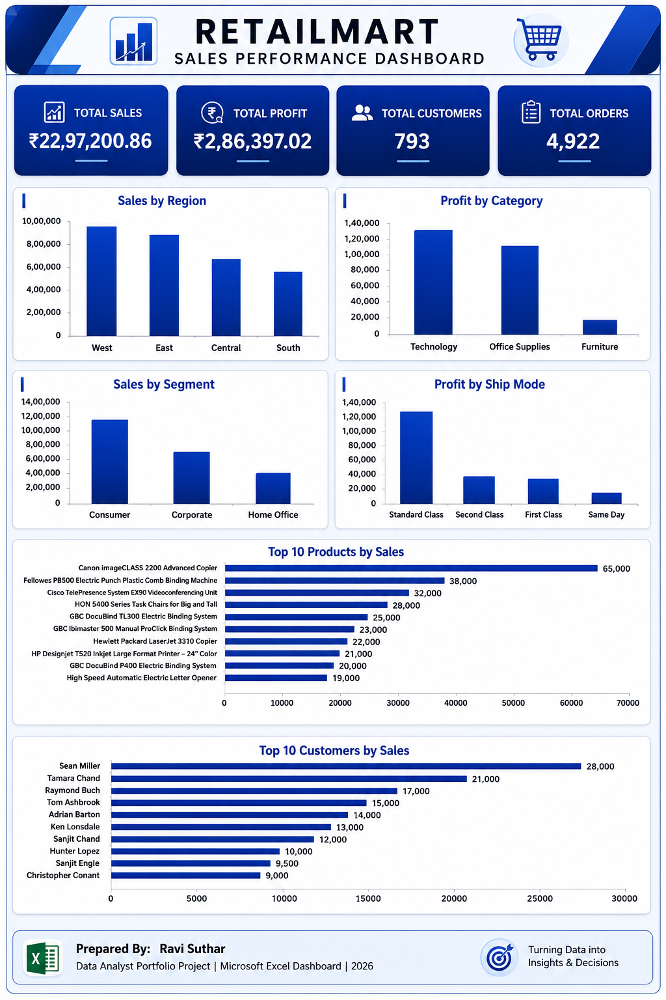

# 📊 RetailMart Sales Performance Dashboard

> A complete Microsoft Excel dashboard project built using Pivot Tables, Pivot Charts, KPI Cards, and Business Analytics to analyze retail sales performance.

---

# 📷 Dashboard Preview



---

# 📌 Project Overview

The **RetailMart Sales Performance Dashboard** is an interactive Microsoft Excel dashboard designed to analyze retail sales data and provide meaningful business insights.

This project demonstrates how Excel can be used for business intelligence by transforming raw sales data into clear visualizations and executive-level reports.

The dashboard focuses on identifying sales trends, customer behavior, product performance, and profitability across different business dimensions.

---

# 🎯 Project Objectives

- Analyze overall sales performance
- Evaluate regional sales and profit
- Identify high-performing product categories
- Understand customer purchasing behavior
- Measure shipping performance
- Build an executive dashboard for business decision-making

---

# 📈 KPI Summary

| KPI | Value |
|------|--------:|
| 💰 Total Sales | ₹22,97,200.86 |
| 📈 Total Profit | ₹2,86,397.02 |
| 👥 Total Customers | 793 |
| 📦 Total Orders | 4,922 |

---

# 📊 Dashboard Features

## Sales Analysis

- Sales by Region
- Sales by Customer Segment

## Profit Analysis

- Profit by Category
- Profit by Ship Mode

## Customer Analysis

- Top 10 Customers by Sales

## Product Analysis

- Top 10 Products by Sales

## KPI Cards

- Total Sales
- Total Profit
- Total Customers
- Total Orders

---

# 💡 Key Business Insights

## Sales Insights

- West region generated the highest sales.
- Technology was the highest revenue-generating category.
- Consumer customers contributed the largest share of total sales.
- Standard Class shipping handled the highest sales volume.
- California recorded the highest sales among all states.
- New York City generated the highest sales among all cities.

---

## Profit Insights

- West region generated the highest overall profit.
- Technology was the most profitable category.
- Consumer customers generated the highest overall profit.
- Standard Class shipping produced the highest profit.
- California recorded the highest state profit.
- New York City generated the highest city profit.

---

# 📌 Business Recommendations

- Continue investing in the West region.
- Increase focus on Technology products.
- Strengthen marketing campaigns targeting Consumer customers.
- Improve Furniture profitability through pricing and cost optimization.
- Expand successful sales strategies to lower-performing regions.

---

# 🛠 Skills Demonstrated

- Microsoft Excel
- Pivot Tables
- Pivot Charts
- Dashboard Design
- KPI Creation
- Data Cleaning
- Data Visualization
- Business Analysis
- Sales Analytics
- Profit Analytics
- Customer Analytics
- Product Performance Analysis

---

# 📂 Project Structure

```text
RetailMart-Sales-Performance-Dashboard
│
├── Dashboard.png
├── README.md
└── RetailMart_Sales_Performance_Dashboard.xlsx
```

---

# 📚 What I Learned

During this project, I improved my skills in:

- Creating Pivot Tables
- Building Pivot Charts
- Designing KPI Cards
- Dashboard Layout Design
- Business Storytelling
- Sales Performance Analysis
- Profitability Analysis
- Customer Segmentation
- Product Performance Evaluation

---

# 🚀 Future Improvements

- Add interactive slicers
- Include monthly sales trend analysis
- Integrate Power Query for automated data refresh
- Build an advanced version using Power BI
- Add dynamic KPI indicators

---

# 🖥 Tools Used

- Microsoft Excel
- Pivot Tables
- Pivot Charts
- Dashboard Formatting

---

# 👨‍💻 Author

## Ravi Suthar

Aspiring Data Analyst | Data Science Enthusiast

- 💼 LinkedIn: https://www.linkedin.com/in/ravi-suthar-b78009218/
- 💻 GitHub: https://github.com/ravisuthar-13

---

## ⭐ If you like this project, consider giving it a Star!

Thank you for visiting this repository.
